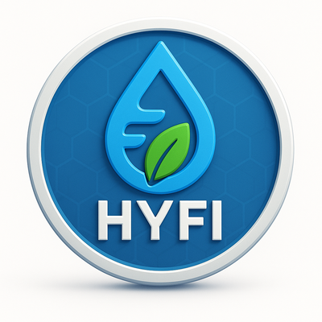

  

# 🌊 HYFI (HydroFi)

**HYFI (HydroFi)** je naslednja generacija digitalnega sredstva, ki združuje **energijo vode** in **blockchain tehnologijo**.  
Naš cilj je ustvariti ekosistem, ki podpira **trajnostno prihodnost**, hkrati pa nudi varne in pregledne transakcije.

---

## 📌 Token Info (BSC Mainnet)

- **Name:** HydroFi  
- **Symbol:** HYFI  
- **Chain:** BNB Smart Chain (BSC)  
- **Contract Address:** `0xc28dF9EbAD0D8A1E8Ab4480F3C94277d182e42e9`  
- **Total Supply:** 100,000,000,000 HYFI  
- **Decimals:** 18  

🔗 [BscScan](https://bscscan.com/token/0xc28dF9EbAD0D8A1E8Ab4480F3C94277d182e42e9)  
🔗 [Website](https://your-website.com)  
🔗 [Twitter](https://twitter.com/your-handle)  
🔗 [Telegram](https://t.me/your-group)  

---

## 🔒 Security Features
- ✅ Anti-whale protection (maxTx 1%, maxWallet 2%)  
- ✅ Cooldown mechanism (30s med transakcijami)  
- ✅ Anti-dump limit za ownerja  
- ✅ Blacklist protection (z možnostjo zamrznitve)  

---

## 📜 Contracts
- **HYFI Token:** [BscScan link](https://bscscan.com/address/0xc28dF9EbAD0D8A1E8Ab4480F3C94277d182e42e9)  
- **FounderLocker:** (link do deployane pogodbe)  

---

## 🚀 How to Use
1. Dodaj **BSC Mainnet** v svojo MetaMask denarnico.  
2. Dodaj token HYFI s pogodbenim naslovom.  
3. Trguj preko DEX-ov (PancakeSwap).  

---

## 🛠️ Build & Contribute
Če želiš prispevati k razvoju HYFI ekosistema:  
- Naredi fork repozitorija  
- Ustvari svojo vejo (`git checkout -b feature/nova-ideja`)  
- Pošlji pull request 🚀  

---

## 📄 License
Ta projekt je pod licenco **MIT**.  
