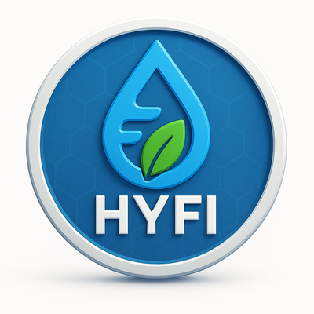

  

# 🌊 HYFI (HydroFi)

**HYFI (HydroFi)** is the next generation digital asset that combines the **power of water** with **blockchain technology**.  
Our mission is to build an ecosystem that supports a **sustainable future**, while ensuring secure and transparent transactions.

---

## 📌 Token Info (BSC Mainnet)

- **Name:** HydroFi  
- **Symbol:** HYFI  
- **Chain:** BNB Smart Chain (BSC)  
- **Contract Address:** `0xc28dF9EbAD0D8A1E8Ab4480F3C94277d182e42e9`  
- **Total Supply:** 100,000,000,000 HYFI  
- **Decimals:** 18  

🔗 [BscScan](https://bscscan.com/token/0xc28dF9EbAD0D8A1E8Ab4480F3C94277d182e42e9)  
🔗 [Website](https://your-website.com)  
🔗 [Twitter](https://twitter.com/your-handle)  
🔗 [Telegram](https://t.me/your-group)  

---

## 🔒 Security Features
- ✅ Anti-whale protection (maxTx 1%, maxWallet 2%)  
- ✅ Cooldown mechanism (30s between transactions)  
- ✅ Anti-dump limit for the owner  
- ✅ Blacklist protection (with freeze option)  

---

## 📜 Contracts
- **HYFI Token:** [BscScan link](https://bscscan.com/address/0xc28dF9EbAD0D8A1E8Ab4480F3C94277d182e42e9)  
- **FounderLocker:** (link to deployed contract)  

---

## 🚀 How to Use
1. Add **BSC Mainnet** to your MetaMask wallet.  
2. Import the HYFI token using the contract address.  
3. Trade on DEX platforms (PancakeSwap).  

---

## 🛠️ Build & Contribute
If you want to contribute to the HYFI ecosystem:  
- Fork this repository  
- Create your feature branch (`git checkout -b feature/new-idea`)  
- Submit a pull request 🚀  

---

## 📄 License
This project is licensed under the **MIT License**.  
